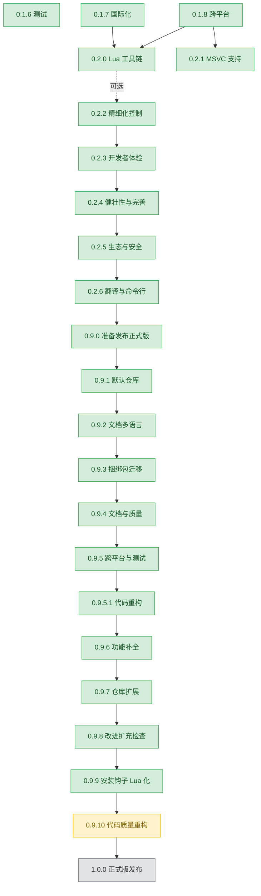

# 规划

EazyMake 版本规划与路线图。每个版本对应一个 Markdown 文件,详细描述该版本的目标,设计方案,实施步骤和注意事项。

---

## 当前执行

- **[0.9.10](0.9.10.md)** - 代码质量重构

## 待执行

- **[1.0.0](1.0.0.md)** - 正式发布

## 已完成

- `0.1.1` ~ `0.1.5`(文件已移除,可以查看对应提交的`plan.md`文件)
- **[0.1.6](0.1.6.md)** - 测试(Catch2 单元测试 + 集成测试)
- **[0.1.7](0.1.7.md)** - 基本国际化(i18n):编译期 JSON 嵌入 + I18nKey 枚举,85+ 个用户可见字符串,中英文双语
- **[0.1.8](0.1.8.md)** - 跨平台支持与编译器探测:Linux/macOS/Windows 多编译器自动检测(g++/clang++),环境变量覆盖,标准库验证
- **[0.2.0](0.2.0.md)** - Lua 工具链:嵌入 Lua 5.4.7 解释器,22 个 ezmk C++ API(项目信息/编译选项/文件系统/进程执行/日志/JSON),sandbox 安全模型,`find_utils_script()` 三作用域查找,内置 `ezmk-cc`(compile_commands.json 生成器),798 断言,零回归
- **[0.2.1](0.2.1.md)** - MSVC 支持:`cl.exe` + `link.exe` + `lib.exe` 完整编译流程,GCC->MSVC 标志翻译层,`/showIncludes` 依赖解析
- **[0.2.2](0.2.2.md)** - 精细化编译控制:可选依赖(`want.lib`),语义化宏定义(`compile.macros`),非标项目结构支持(`compile.src_dirs`)
- **[0.2.3](0.2.3.md)** - 开发者体验提升:并行编译(`-j`),构建 Profile(`--profile`),Build Hooks(`[hooks]`),Watch 模式,`pkg list`/`pkg update`,Bug 修复
- **[0.2.4](0.2.4.md)** - 健壮性与完善:Bug 修复(版本比较统一,Shell 注入,`/tmp` 路径),代码质量(`build_project` 重构,CLI 去重,帮助 i18n),功能补全(C23,`pkg update --all`,MSVC 标志扩展)
- **[0.2.5](0.2.5.md)** - 生态与安全:zsh 命令补全,Utils 细粒度权限管理(read/write/run 白名单),仓库系统完善(`repo info`,跨仓库版本选择,本地仓库校验增强,`--auto-update`)
- **[0.2.6](0.2.6.md)** - 翻译补全和命令行改进:i18n 单一数据源(X-macro,根除 `{???}`),帮助正文与参数校验报错全本地化,命令简写(`pb`/`ki`/…),全局 `--color=<mode>`;附带修复 POSIX `run_command` stderr 捕获
- **[0.9.0](0.9.0.md)** - 准备发布正式版
- **[0.9.1](0.9.1.md)** - 默认仓库创建
- **[0.9.2](0.9.2.md)** - 文档多语言
- **[0.9.3](0.9.3.md)** - 捆绑包迁移:7 个预编译包→官方仓库,ezmk-cc 保留内置
- **[0.9.4](0.9.4.md)** - 文档与质量完善:FAQ/故障排除,CHANGES.md 补全,错误信息打磨,Lua API 版本化,离线文档
- **[0.9.5](0.9.5.md)** - 跨平台体验与质量保障:PowerShell 安装脚本(`install.ps1`),端到端集成测试(7 个场景),三平台冒烟测试准备
- **[0.9.5.1](0.9.5.1.md)** - 代码重构与质量清理:消除 ~500 行重复代码,RAII 资源管理修复,测试盲区补全(497→497 用例/2250 断言),死代码移除,共享测试 fixtures
- **[0.9.6](0.9.6.md)** - 功能补全与生态完善:依赖版本锁定,构建进度显示,.clang-format 基础设施,ASCII Logo
- **[0.9.7](0.9.7.md)** - 仓库扩展:22 个新包(cli11/zlib/glfw/yaml-cpp/sdl2/imgui+16 backends),header-only 支持,预编译包支持,包制作指南
- **[0.9.8](0.9.8.md)** - 改进扩充检查:CLI 输出统一(`[ezmk]` 前缀),`--verbose` 简写展开提示,默认仓库再扩充 20 个包(stb×10 + Boost×10)
- **[0.9.9](0.9.9.md)** - 安装钩子 Lua 化:`.lua` 脚本优先,`run_install_hook_script()`,sandbox 安全模型对齐,向后兼容旧 shell 脚本

---

## 版本主题概览

| 版本    | 主题         | 关键交付                                                                                                                                                         | 依赖                                            |
| ------- | ------------ | ---------------------------------------------------------------------------------------------------------------------------------------------------------------- | ----------------------------------------------- |
| 0.1.6   | 测试         | Catch2 单元测试(10 个模块),集成测试(50+ 场景),>80% 关键路径覆盖率                                                                                                | -                                               |
| 0.1.7   | 国际化       | i18n 模块,85 个 I18nKey,en.json + zh.json,`EZMK_LANG` 环境变量                                                                                                   | -                                               |
| 0.1.8   | 跨平台       | `detect_compiler()`,`$CXX/$CC` 覆盖,macOS/Linux/Windows 平台宏完善                                                                                               | -                                               |
| 0.2.0   | Lua 工具链   | Lua 5.4.7 静态链接,ezmk Lua API(22 函数),sandbox 安全模型,`find_utils_script()`,内置 `ezmk-cc`                                                                   | 0.1.7(i18n 集成),0.1.8(编译器检测集成)          |
| 0.2.1   | MSVC 支持    | `Toolchain` 抽象层,GCC->MSVC 标志翻译,`/showIncludes` 依赖解析,MSVC 编译/链接/归档流程                                                                           | 0.1.8(编译器探测基础)                           |
| 0.2.2   | 精细化控制   | `want.lib` 可选依赖,`compile.macros` 宏定义,`compile.src_dirs` 多源目录                                                                                          | 0.2.0(Lua 工具链可配合使用)                     |
| 0.2.3   | 开发者体验   | `-j` 并行编译,`--profile` 构建配置,`[hooks]` 构建钩子,Watch 模式,`pkg list`/`pkg update`,Bug 修复                                                                | 0.2.2(编译控制基础)                             |
| 0.2.4   | 健壮性与完善 | Bug 修复(版本比较,Shell 注入,`/tmp`),代码质量(`build_project` 重构,CLI 去重,帮助 i18n),功能补全(C23,`pkg update --all`,MSVC 标志扩展)                            | 0.2.3(所有功能模块)                             |
| 0.2.5   | 生态与安全   | zsh 命令补全,Utils 权限管理(read/write/run 白名单),仓库系统完善(`repo info`,跨仓库版本选择,本地仓库校验,`--auto-update`)                                         | 0.2.4(统一版本比较,Shell 转义,Lua sandbox 基础) |
| 0.2.6   | 翻译与命令行 | i18n 单一数据源(X-macro `i18n_keys.def`,根除 `{???}`),帮助/报错全本地化,命令简写(`p*`/`k*`/`r*`),全局 `--color=<mode>`,`run_command` stderr 修复                 | 0.2.5(帮助 i18n,GNU 参数解析层)                 |
| 0.9.0   | 发布正式版   | 一键安装脚本(`install.sh`,`curl \| bash`),文档整理(`docs/cli.md`,安全性集中化,README 双语互链),基本教程(`tutorial/`);**不新增核心功能**                          | 0.2.6(功能与命令行收尾完成)                     |
| 0.9.1   | 默认仓库创建 | 创建并托管官方默认仓库(符合 `docs/repo.md` 结构),打包→sha256→`index.toml` 可复现流程 + CI 校验,ezmk 侧预注册策略,初始包与贡献流程                                | 0.9.0(正式版发布基础)                           |
| 0.9.2   | 文档多语言   | `docs/` 和 `tutorial/` 拆分 `en/` + `zh/` 子目录,补齐英文翻译,术语表,CI 检查文件对应                                                                             | 0.9.0(文档基础)                                 |
| 0.9.3   | 捆绑包迁移   | 7 个 `pkg/*.tar.gz` 捆绑库包提取源工程→官方仓库,补版本号与 TOML 格式,清理 `install.sh` 冗余拷贝,`ezmk-cc` 保留内置                                               | 0.9.1(官方仓库就绪)                             |
| 0.9.4   | 文档与质量   | FAQ/故障排除文档,CHANGES.md 补全(0.2.6→0.9.4),错误信息打磨(closest_match 模糊建议),Lua API 版本化(`EZMK_LUA_API_VERSION` + `ezmk.api_version`),离线场景文档      | 0.9.3(捆绑包迁移完成)                           |
| 0.9.5   | 跨平台与测试 | PowerShell 安装脚本(`install.ps1`),集成测试(端到端:new→install→build→run),三平台冒烟测试(Linux/macOS/Windows)                                                    | 0.9.4(文档就绪)                                 |
| 0.9.5.1 | 代码重构     | 消除代码重复(~500 行),RAII 资源管理修复,补全测试盲区(compare_version/extract_archive),移除死代码(count/native_path),共享测试 fixtures,平台宏统一,i18n 硬编码消除 | 0.9.5(集成测试就绪)                             |
| 0.9.6   | 功能补全     | 依赖版本锁定(`foo@1.2.3`/`^1.0`/`~1.2`/`>=1.0`),构建进度显示(逐文件 `[N/M]`),`.clang-format` 基础设施,ASCII Logo,魔术字符串常量化(`ezmk::path::*`,0.9.5.1 延后)  | 0.9.5.1(代码清理完成)                           |
| 0.9.7   | 仓库扩展     | 22 个新包,header-only 支持(`ezmk.toml`),预编译包支持(`precompiled = true`),包制作指南(en+zh)                                                                        | 0.9.6(依赖版本锁定)                             |
| 0.9.8   | 改进扩充检查 | CLI 输出统一(`[ezmk]` 前缀 + `info_line()`),`--verbose` 简写展开提示,默认仓库新增 20 个包(stb×10 + Boost header-only×10)                                                | 0.9.7(header-only 支持)                         |
| 0.9.9   | 技术栈统一   | 安装钩子 Lua 化(`.lua` 优先,`run_install_hook_script()`,sandbox 对齐),向后兼容 shell 脚本                                                                               | 0.2.3(构建钩子 Lua 基础设施)                    |
| 0.9.10  | 代码质量重构 | 消除 `run_install_hook_script`/`run_hook_script` ~70 行重复,压缩 `run_install_script` 参数(9→6),Lua 栈断言加固,`detect_install_script` 可测试化                          | 0.9.9(安装钩子 Lua 化完成)                      |

## 依赖关系图

> 说明:绿色=已完成,黄色=当前执行,灰色=待执行;虚线为可选依赖。

---

## 跨版本关注点

以下关注点跨越多个版本,需在各版本计划中协同考虑:

### 向后兼容性
- `ezmk.toml` 格式扩展添加可选字段(`msvc_flags`,`[utils]`,`want.lib`,`compile.macros`),不影响已有配置
- `record.json` 的 `version` 字段支持缓存格式演进
- CLI 接口保持稳定(新增 flag 不破坏已有 flag);0.2.6 的命令简写(`pb`/`ki`/…)与全局 `--color=<mode>` 均为纯增量,现有写法不受影响
- i18n 键治理:0.2.6 起以 `include/ezmk/i18n_keys.def`(X-macro)为单一数据源,枚举与 `key_name()` 自动派生,新增键只需改 `.def` + 两份 JSON,杜绝 `{???}` 失配

### 安全模型
- 全局安装确认(已有,`pkg.cpp`):0.1.6 测试已覆盖
- SHA-256 校验(已有):0.1.6 测试已覆盖,0.2.0 的 Lua API 中也可使用
- Lua sandbox(0.2.0):`os.execute`/`io.popen` 编译期移除,文件写入限制,独立环境表,脚本间隔离
- Utils 权限管理(0.2.5):细粒度白名单控制(read/write/run),向后兼容(未声明权限的旧包行为不变 + deprecation warning)
- repo 校验(已有):`index.toml` 解析 + clone 失败清理;0.2.5 增强本地仓库校验(file 存在性,sha256 格式)

### 跨平台一致性
- 0.1.8 编译器探测 + 0.2.1 MSVC 支持:同一份 `ezmk.toml` 可在 Windows/MSVC 和 Linux/GCC 下编译
- 缓存记录中的 `compiler` 字段天然隔离不同编译器的缓存
- 路径处理:Windows 用反斜杠,Linux/macOS 用正斜杠
- 进程执行:`run_command()` 在 Windows 走 `CreateProcess` 独立管道,POSIX 走临时文件重定向;0.2.6 起 POSIX 侧用花括号组 `{ cmd ; } 1>out 2>err` 包裹,确保被调命令自身的 fd 重定向(如 `>&2`)不会污染 stdout/stderr 捕获
