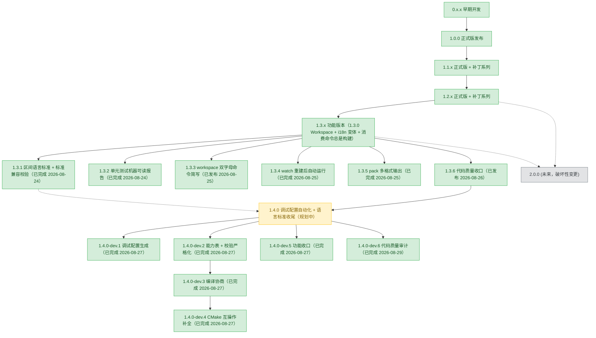

# 规划

EazyMake 版本规划与路线图。每个版本对应一个 Markdown 文件,详细描述该版本的目标,设计方案,实施步骤和注意事项。

## 目录结构

按版本系列分组，每个目录对应一个发布系列，目录内 `README.md` 为该系列的版本索引：

```
plans/
├── README.md       # 索引 + 路线图 + 依赖关系图
├── 0.x.x/          # 0.x 早期开发版本（0.1.6 ~ 0.2.6）
│   ├── README.md
│   └── 0.1.6.md ~ 0.2.6.md
├── 1.0.0/          # 1.0.0 发布系列（0.9.0 ~ 1.0.0，含发布准备版本）
│   ├── README.md
│   └── 0.9.0.md ~ 1.0.0.md
├── 1.1.x/          # 1.1.x 系列文档（1.1.0 正式版 + 1.1.1/1.1.2/1.1.3 补丁，平铺无子目录）
│   ├── README.md
│   └── 1.1.0*.md / 1.1.1.md / 1.1.2.md / 1.1.3.md
└── 1.2.x/          # 1.2.x 正式版 + 补丁系列（1.2.0 正式版 + 1.2.1 补丁，平铺无子目录）
    ├── README.md
    └── 1.2.0-dev.N.md / 1.2.0-pre.N.md / 1.2.0.md / 1.2.1.md
└── 1.3.x/          # 1.3.x 功能版本系列（1.3.0 Workspace 工作区，平铺无子目录）
    ├── README.md
    └── 1.3.0-dev.N.md / 1.3.0-pre.N.md / 1.3.0.md
└── 1.4.x/          # 1.4.x 功能版本系列（1.4.0 调试配置自动化 + 语言标准收尾，平铺无子目录）
    ├── README.md
    └── 1.4.0-dev.N.md / 1.4.0-pre.N.md（规划中）/ 1.4.0.md（规划中）
```

> 仓库根目录的 `plan.md` 为当前执行计划。**1.2.x 补丁系列（1.2.1~1.2.5）已全部发布/完成**（1.2.5：测试缓存修复 01807bb + 默认包格式改为源码包，2026-08-19 发布，tag `v1.2.5`）；**1.3.0 已发布**（Workspace 工作区 + i18n 语言变体 + 消费命令总是自动构建，2026-08-21，tag `v1.3.0`）；**1.3.1 / 1.3.2 已完成（实现收口，2026-08-24，tag `v1.3.1`/`v1.3.2`）**；**1.3.3 已发布（2026-08-25，tag `v1.3.3`，三渠道分发完成）**；**1.3.4 / 1.3.5 已完成（实现收口，2026-08-25，tag `v1.3.4`/`v1.3.5`）**；**1.3.6 已发布（2026-08-26，tag `v1.3.6`，三渠道分发完成）——1.3.x 全部补丁收口**；**1.4.0-dev.1 已完成（调试配置生成，2026-08-27，实现收口）**；**1.4.0-dev.2 已完成（工具链能力表 + 校验严格化，2026-08-27，实现收口）**；**1.4.0-dev.3 已完成（编译协商语义 B，2026-08-27，实现收口）**；**1.4.0-dev.4 已完成（CMake 互操作补全，2026-08-27，实现收口）**；**1.4.0-dev.5 已完成（功能收口，2026-08-27，实现收口）**；**1.4.0-dev.6 已完成（代码质量审计，2026-08-29，实现收口）**；**1.4.0-pre.1 规划中（发布前收口）**。下一个破坏性窗口 **2.0.0**。

---

## 当前执行

- **1.4.0-dev.1** —— 调试配置生成：`project export vscode` 三件套（launch/tasks/settings）+ per-platform 调试器 + profile 联动（[`plans/1.4.x/1.4.0-dev.1.md`](1.4.x/1.4.0-dev.1.md)）—— **✅ 已完成（2026-08-27）**
- **1.4.0-dev.2** —— 工具链能力表 + 校验严格化：`max_supported_std(family, version)` + `[pkg] strict_std_check`（[`plans/1.4.x/1.4.0-dev.2.md`](1.4.x/1.4.0-dev.2.md)）—— **✅ 已完成（2026-08-27）**
- **1.4.0-dev.3** —— 编译协商（语义 B）：包按 `max(包min, 消费者min)` 重编（[`plans/1.4.x/1.4.0-dev.3.md`](1.4.x/1.4.0-dev.3.md)）；依赖 dev.2 —— **✅ 已完成（2026-08-27）**
- **1.4.0-dev.4** —— CMake 互操作补全：`import` 读 `CXX_STANDARD` → 区间 language（[`plans/1.4.x/1.4.0-dev.4.md`](1.4.x/1.4.0-dev.4.md)）—— **✅ 已完成（2026-08-27）**
- **1.4.0-dev.5** —— 功能收口：watch `--` 透传 / `workspace watch` / `tgz` 别名 / sha256 边车自动校验（[`plans/1.4.x/1.4.0-dev.5.md`](1.4.x/1.4.0-dev.5.md)）—— **✅ 已完成（2026-08-27）**
- **1.4.0-dev.6** —— 代码质量审计：8 路并行审查全量代码，修复 8 P0 + 高价值 P1 + 4 恒真测试（[`plans/1.4.x/1.4.0-dev.6.md`](1.4.x/1.4.0-dev.6.md)）—— **✅ 已完成（2026-08-29）**
- **1.4.0-pre.1** —— 发布前收口（用户触达打磨 / 全量文档检查 / 缺陷收集，规划中）

## 未来规划

- **2.0.0** —— 破坏性变更窗口（`CHANGES.md` API 稳定性承诺：破坏性变更仅在 2.0.0 引入，且至少提前 1 个 minor 版本给出 deprecation warning；`[test].flags` / `ezmk utils cc` 移除等）

## 已完成

- **[0.x.x](0.x.x/README.md)** — 0.x 早期开发版本（0.1.6 ~ 0.2.6），全部完成 ✅
- **[1.0.0](1.0.0/README.md)** — 正式版发布系列（0.9.0 ~ 1.0.0，含发布准备版本），全部完成 ✅
- **[1.1.x](1.1.x/README.md)** — 正式版 + 补丁发布系列（1.1.0 + 1.1.1 + 1.1.2 + 1.1.3），全部完成 ✅
- **[1.2.x](1.2.x/README.md)** — 正式版 + 补丁发布系列（1.2.0 工具链互操作与开箱工程化 2026-08-17 已发布 ✅；1.2.1 模板差异化 2026-08-18 已发布 ✅；1.2.2 教程分类重组 / 1.2.3 `ezmk example` 命令组 已完成并打 tag；1.2.4 仓库文件夹包支持 2026-08-18 已发布 ✅）
- **[1.3.x](1.3.x/README.md)** — 功能版本系列：1.3.0 Workspace 工作区（`ezmk workspace` 命令组 + `ezmk-workspace.toml` + i18n 语言变体 + 消费命令总是自动构建）**2026-08-21 已发布 ✅**（tag `v1.3.0`）；1.3.1 区间语言标准 + 标准兼容校验 **2026-08-24 实现收口 ✅**（tag `v1.3.1`）；1.3.2 单元测试机器可读报告 **2026-08-24 实现收口 ✅**（tag `v1.3.2`）；1.3.3 workspace 双字母命令简写 **2026-08-25 已发布 ✅**（tag `v1.3.3`，三渠道分发：winget PR #423828 / homebrew tap / pacman PKGBUILD）；1.3.4 watch 重建后自动运行 **2026-08-25 实现收口 ✅**（tag `v1.3.4`）；1.3.5 pack 多格式输出 **2026-08-25 实现收口 ✅**（tag `v1.3.5`）；1.3.6 代码质量收口 **2026-08-26 已发布 ✅**（tag `v1.3.6`，三渠道分发：winget PR #424481 / homebrew tap / pacman PKGBUILD）——**1.3.x 全部收口**

## 版本系列概览

| 系列 | 主题 | 关键交付 | 索引 |
|------|------|----------|------|
| 0.x.x | 早期开发 | 测试框架 / i18n / 跨平台 / Lua 工具链 / MSVC 支持 / 精细化控制 / 开发者体验 / 生态与安全 / 翻译收尾 | [0.x.x/README.md](0.x.x/README.md) |
| 1.0.0 | 打磨发布 | 一键安装 / 默认仓库 / 文档多语言 / 捆绑包迁移 / 跨平台测试 / 正式版发布 | [1.0.0/README.md](1.0.0/README.md) |
| 1.1.x | 正式版 + 补丁 | 1.1.0 包编译与开发体验 + 1.1.1 cc 拦截 + 1.1.2 安全与正确性 + 1.1.3 安全收敛二轮/健壮性收口 | [1.1.x/README.md](1.1.x/README.md) |
| 1.2.x | 正式版 + 补丁 | 1.2.0 工具链互操作与开箱工程化 + 1.2.1 模板差异化（库骨架 .hpp/.cpp）+ 1.2.2 教程分类重组 + 1.2.3 `ezmk example` 命令组与内置示例 + 1.2.4 仓库文件夹包支持 + 1.2.5 测试缓存修复与默认源码包（已发布） | [1.2.x/README.md](1.2.x/README.md) |
| 1.3.x | 功能版本 | 1.3.0 Workspace 工作区（`ezmk workspace` 命令组 + `ezmk-workspace.toml`；批量 + 并行）+ i18n 语言变体（dev.4，`zh-TW` 继承式变体）+ 消费命令总是自动构建（dev.5）（**已发布**，2026-08-21，tag `v1.3.0`）；1.3.1 区间语言标准 + 标准兼容校验（**已完成**，2026-08-24）；1.3.2 单元测试机器可读报告（**已完成**，2026-08-24）；1.3.3 workspace 双字母命令简写（**已发布**，2026-08-25，tag `v1.3.3`）；1.3.4 watch 重建后自动运行（**已完成**，2026-08-25）；1.3.5 pack 多格式输出（**已完成**，2026-08-25）；1.3.6 代码质量收口（**已发布**，2026-08-26，tag `v1.3.6`） | [1.3.x/README.md](1.3.x/README.md) |
| 1.4.x | 功能版本 | 1.4.0 调试配置自动化（`project export vscode` 三件套，per-platform 调试器）+ 语言标准收尾（工具链能力表 `max_supported_std` + 校验严格化开关 + 编译协商语义 B + CMake `CXX_STANDARD` 导入映射）+ 功能收口（watch `--` 透传 / `workspace watch` / `tgz` 别名 / sha256 边车自动校验）+ 代码质量审计（8 P0 + 高价值 P1 + 4 恒真测试）（dev.1 ~ dev.6 **已完成**，pre.1 规划中） | [1.4.x/README.md](1.4.x/README.md) |

## 依赖关系图


```mermaid
graph TD
    v0xx["0.x.x 早期开发"]
    v100["1.0.0 正式版发布"]
    v11x["1.1.x 正式版 + 补丁系列"]
    v12x["1.2.x 正式版 + 补丁系列"]
    v13x["1.3.x 功能版本（1.3.0 Workspace + i18n 变体 + 消费命令总是构建）"]
    v131["1.3.1 区间语言标准 + 标准兼容校验（已完成 2026-08-24）"]
    v132["1.3.2 单元测试机器可读报告（已完成 2026-08-24）"]
    v133["1.3.3 workspace 双字母命令简写（已发布 2026-08-25）"]
    v134["1.3.4 watch 重建后自动运行（已完成 2026-08-25）"]
    v135["1.3.5 pack 多格式输出（已完成 2026-08-25）"]
    v136["1.3.6 代码质量收口（已发布 2026-08-26）"]
    v140["1.4.0 调试配置自动化 + 语言标准收尾（规划中）"]
    v141["1.4.0-dev.1 调试配置生成（已完成 2026-08-27）"]
    v142["1.4.0-dev.2 能力表 + 校验严格化（已完成 2026-08-27）"]
    v143["1.4.0-dev.3 编译协商（已完成 2026-08-27）"]
    v144["1.4.0-dev.4 CMake 互操作补全（已完成 2026-08-27）"]
    v145["1.4.0-dev.5 功能收口（已完成 2026-08-27）"]
    v146["1.4.0-dev.6 代码质量审计（已完成 2026-08-29）"]
    v200["2.0.0 (未来，破坏性变更)"]

    v0xx --> v100
    v100 --> v11x
    v11x --> v12x
    v12x --> v13x
    v13x --> v131
    v13x --> v132
    v13x --> v133
    v13x --> v134
    v13x --> v135
    v13x --> v136
    v136 --> v140
    v140 --> v141
    v140 --> v142
    v142 --> v143
    v143 --> v144
    v140 --> v145
    v140 --> v146
    v131 -.-> v140
    v12x -.-> v200
    v13x -.-> v200

    classDef done fill:#d4edda,stroke:#28a745,color:#155724;
    classDef active fill:#fff3cd,stroke:#ffc107,color:#856404;
    classDef todo fill:#e2e3e5,stroke:#6c757d,color:#383d41;

    class v0xx,v100 done;
    class v11x done;
    class v12x done;
    class v13x done;
    class v131 done;
    class v132 done;
    class v133 done;
    class v134 done;
    class v135 done;
    class v136 done;
    class v140 active;
    class v141 done;
    class v142 done;
    class v143 done;
    class v144 done;
    class v145 done;
    class v146 done;
    class v200 todo;
```

> 说明:绿色=已完成,黄色=当前执行,灰色=待执行;虚线为可选依赖。各系列内版本的详细依赖见系列 README 的版本列表。

---

## 跨版本关注点

以下关注点跨越多个版本,需在各版本计划中协同考虑:

### 向后兼容性
- `ezmk.toml` 格式扩展添加可选字段(`msvc_flags`,`[utils]`,`want.lib`,`compile.macros`),不影响已有配置
- `record.json` 的 `version` 字段支持缓存格式演进
- CLI 接口保持稳定(新增 flag 不破坏已有 flag);0.2.6 的命令简写(`pb`/`ki`/…)与全局 `--color=<mode>` 均为纯增量,现有写法不受影响
- i18n 键治理:0.2.6 起以 `include/ezmk/i18n_keys.def`(X-macro)为单一数据源,枚举与 `key_name()` 自动派生,新增键只需改 `.def` + 两份 JSON,杜绝 `{???}` 失配

### 发布门槛（1.1.0-pre.3 起生效）
- **没有完成实现，或破坏了兼容性的版本，不得正式发布**
- 发布前必须同时满足：① 计划清单（缺陷/未实现项）全部完成或明确收口；② 公共 API 无破坏性变更（破坏性变更仅在 `2.0.0` 引入）；③ 全量测试零回归（`bash build.sh test` + `test-all`）
- 详细 Gate 定义见 `plans/1.1.x/1.1.0-pre.3.md`「⛔ 发布门槛」

### 安全模型
- 全局安装确认(已有,`pkg.cpp`):0.1.6 测试已覆盖
- SHA-256 校验(已有):0.1.6 测试已覆盖,0.2.0 的 Lua API 中也可使用
- Lua sandbox(0.2.0):`os.execute`/`io.popen` 编译期移除,文件写入限制,独立环境表,脚本间隔离
- Utils 权限管理(0.2.5):细粒度白名单控制(read/write/run),向后兼容(未声明权限的旧包行为不变 + deprecation warning)
- repo 校验(已有):`index.toml` 解析 + clone 失败清理;0.2.5 增强本地仓库校验(file 存在性,sha256 格式)
- 解压路径包含校验(1.1.2):归档条目名经 `safe_extract_path()` 校验,拒绝 `..`/绝对路径/盘符/UNC,并设 tar.gz 解压大小上限
- Lua 沙箱收敛(1.1.2):沙箱 `__index` 从裸 `_G` 改为受限全局表,不暴露 `dofile`/`loadfile`/`load`/`require`/`debug`(详见 [`plans/1.1.x/1.1.2.md`](1.1.x/1.1.2.md#34-s4lua-沙箱收敛))

### 跨平台一致性
- 0.1.8 编译器探测 + 0.2.1 MSVC 支持:同一份 `ezmk.toml` 可在 Windows/MSVC 和 Linux/GCC 下编译
- 缓存记录中的 `compiler` 字段天然隔离不同编译器的缓存
- 路径处理:Windows 用反斜杠,Linux/macOS 用正斜杠
- 进程执行:`run_command()` 在 Windows 走 `CreateProcess` 独立管道,POSIX 走临时文件重定向;0.2.6 起 POSIX 侧用花括号组 `{ cmd ; } 1>out 2>err` 包裹,确保被调命令自身的 fd 重定向(如 `>&2`)不会污染 stdout/stderr 捕获
