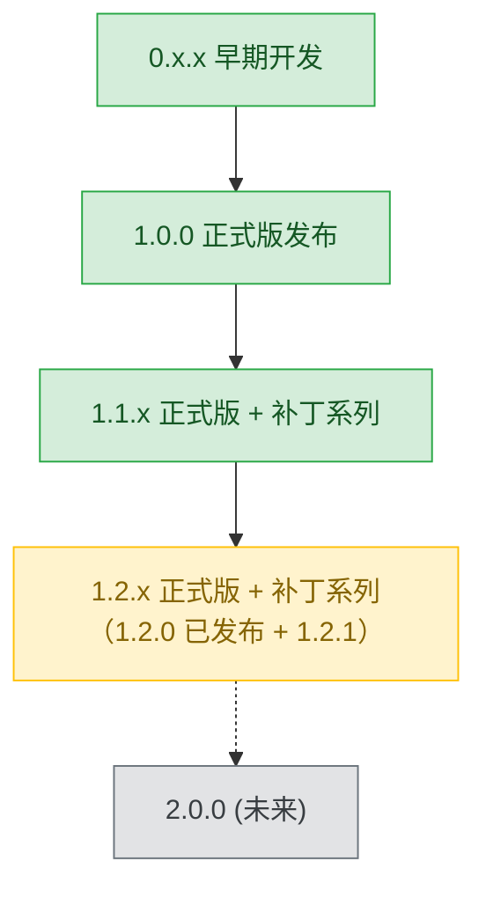

# 规划

EazyMake 版本规划与路线图。每个版本对应一个 Markdown 文件,详细描述该版本的目标,设计方案,实施步骤和注意事项。

## 目录结构

按版本系列分组，每个目录对应一个发布系列，目录内 `README.md` 为该系列的版本索引：

```
plans/
├── README.md       # 索引 + 路线图 + 依赖关系图
├── 0.x.x/          # 0.x 早期开发版本（0.1.6 ~ 0.2.6）
│   ├── README.md
│   └── 0.1.6.md ~ 0.2.6.md
├── 1.0.0/          # 1.0.0 发布系列（0.9.0 ~ 1.0.0，含发布准备版本）
│   ├── README.md
│   └── 0.9.0.md ~ 1.0.0.md
├── 1.1.x/          # 1.1.x 系列文档（1.1.0 正式版 + 1.1.1/1.1.2/1.1.3 补丁，平铺无子目录）
│   ├── README.md
│   └── 1.1.0*.md / 1.1.1.md / 1.1.2.md / 1.1.3.md
└── 1.2.x/          # 1.2.x 正式版 + 补丁系列（1.2.0 正式版 + 1.2.1 补丁，平铺无子目录）
    ├── README.md
    └── 1.2.0-dev.N.md / 1.2.0-pre.N.md / 1.2.0.md / 1.2.1.md
```

> 仓库根目录的 `plan.md` 为当前执行计划。**1.2.0 已于 2026-08-17 正式发布**（tag `v1.2.0`）；当前推进 **1.2.1**（补丁）。下一个版本窗口 **2.0.0**（破坏性变更）。

---

## 当前执行

- **[1.2.1](1.2.x/1.2.1.md)** — 按项目类型差异化模板生成（`project new` 的 static/shared 生成 `include/<name>.hpp` + `src/<name>.cpp` 库骨架，executable/utils 保持现状）

## 未来规划

- **2.0.0** —— 破坏性变更窗口（`CHANGES.md` API 稳定性承诺：破坏性变更仅在 2.0.0 引入，且至少提前 1 个 minor 版本给出 deprecation warning）

## 已完成

- **[0.x.x](0.x.x/README.md)** — 0.x 早期开发版本（0.1.6 ~ 0.2.6），全部完成 ✅
- **[1.0.0](1.0.0/README.md)** — 正式版发布系列（0.9.0 ~ 1.0.0，含发布准备版本），全部完成 ✅
- **[1.1.x](1.1.x/README.md)** — 正式版 + 补丁发布系列（1.1.0 + 1.1.1 + 1.1.2 + 1.1.3），全部完成 ✅
- **[1.2.x](1.2.x/README.md)** — 正式版 + 补丁发布系列（1.2.0 工具链互操作与开箱工程化 2026-08-17 已发布 ✅；1.2.1 模板差异化进行中）

## 版本系列概览

| 系列 | 主题 | 关键交付 | 索引 |
|------|------|----------|------|
| 0.x.x | 早期开发 | 测试框架 / i18n / 跨平台 / Lua 工具链 / MSVC 支持 / 精细化控制 / 开发者体验 / 生态与安全 / 翻译收尾 | [0.x.x/README.md](0.x.x/README.md) |
| 1.0.0 | 打磨发布 | 一键安装 / 默认仓库 / 文档多语言 / 捆绑包迁移 / 跨平台测试 / 正式版发布 | [1.0.0/README.md](1.0.0/README.md) |
| 1.1.x | 正式版 + 补丁 | 1.1.0 包编译与开发体验 + 1.1.1 cc 拦截 + 1.1.2 安全与正确性 + 1.1.3 安全收敛二轮/健壮性收口 | [1.1.x/README.md](1.1.x/README.md) |
| 1.2.x | 正式版 + 补丁 | 1.2.0 工具链互操作与开箱工程化 + 1.2.1 模板差异化（库骨架 .hpp/.cpp）+ 1.2.2 教程分类重组 + 1.2.3 `ezmk example` 命令组与内置示例 + 1.2.4 仓库文件夹包支持 | [1.2.x/README.md](1.2.x/README.md) |

## 依赖关系图


```mermaid
graph TD
    v0xx["0.x.x 早期开发"]
    v100["1.0.0 正式版发布"]
    v11x["1.1.x 正式版 + 补丁系列"]
    v12x["1.2.x 正式版 + 补丁系列（1.2.0 已发布 + 1.2.1）"]
    v200["2.0.0 (未来)"]

    v0xx --> v100
    v100 --> v11x
    v11x --> v12x
    v12x -.-> v200

    classDef done fill:#d4edda,stroke:#28a745,color:#155724;
    classDef active fill:#fff3cd,stroke:#ffc107,color:#856404;
    classDef todo fill:#e2e3e5,stroke:#6c757d,color:#383d41;

    class v0xx,v100 done;
    class v11x done;
    class v12x active;
    class v200 todo;
```

> 说明:绿色=已完成,黄色=当前执行,灰色=待执行;虚线为可选依赖。各系列内版本的详细依赖见系列 README 的版本列表。

---

## 跨版本关注点

以下关注点跨越多个版本,需在各版本计划中协同考虑:

### 向后兼容性
- `ezmk.toml` 格式扩展添加可选字段(`msvc_flags`,`[utils]`,`want.lib`,`compile.macros`),不影响已有配置
- `record.json` 的 `version` 字段支持缓存格式演进
- CLI 接口保持稳定(新增 flag 不破坏已有 flag);0.2.6 的命令简写(`pb`/`ki`/…)与全局 `--color=<mode>` 均为纯增量,现有写法不受影响
- i18n 键治理:0.2.6 起以 `include/ezmk/i18n_keys.def`(X-macro)为单一数据源,枚举与 `key_name()` 自动派生,新增键只需改 `.def` + 两份 JSON,杜绝 `{???}` 失配

### 发布门槛（1.1.0-pre.3 起生效）
- **没有完成实现，或破坏了兼容性的版本，不得正式发布**
- 发布前必须同时满足：① 计划清单（缺陷/未实现项）全部完成或明确收口；② 公共 API 无破坏性变更（破坏性变更仅在 `2.0.0` 引入）；③ 全量测试零回归（`bash build.sh test` + `test-all`）
- 详细 Gate 定义见 `plans/1.1.x/1.1.0-pre.3.md`「⛔ 发布门槛」

### 安全模型
- 全局安装确认(已有,`pkg.cpp`):0.1.6 测试已覆盖
- SHA-256 校验(已有):0.1.6 测试已覆盖,0.2.0 的 Lua API 中也可使用
- Lua sandbox(0.2.0):`os.execute`/`io.popen` 编译期移除,文件写入限制,独立环境表,脚本间隔离
- Utils 权限管理(0.2.5):细粒度白名单控制(read/write/run),向后兼容(未声明权限的旧包行为不变 + deprecation warning)
- repo 校验(已有):`index.toml` 解析 + clone 失败清理;0.2.5 增强本地仓库校验(file 存在性,sha256 格式)
- 解压路径包含校验(1.1.2):归档条目名经 `safe_extract_path()` 校验,拒绝 `..`/绝对路径/盘符/UNC,并设 tar.gz 解压大小上限
- Lua 沙箱收敛(1.1.2):沙箱 `__index` 从裸 `_G` 改为受限全局表,不暴露 `dofile`/`loadfile`/`load`/`require`/`debug`(详见 [`plans/1.1.x/1.1.2.md`](1.1.x/1.1.2.md#34-s4lua-沙箱收敛))

### 跨平台一致性
- 0.1.8 编译器探测 + 0.2.1 MSVC 支持:同一份 `ezmk.toml` 可在 Windows/MSVC 和 Linux/GCC 下编译
- 缓存记录中的 `compiler` 字段天然隔离不同编译器的缓存
- 路径处理:Windows 用反斜杠,Linux/macOS 用正斜杠
- 进程执行:`run_command()` 在 Windows 走 `CreateProcess` 独立管道,POSIX 走临时文件重定向;0.2.6 起 POSIX 侧用花括号组 `{ cmd ; } 1>out 2>err` 包裹,确保被调命令自身的 fd 重定向(如 `>&2`)不会污染 stdout/stderr 捕获
